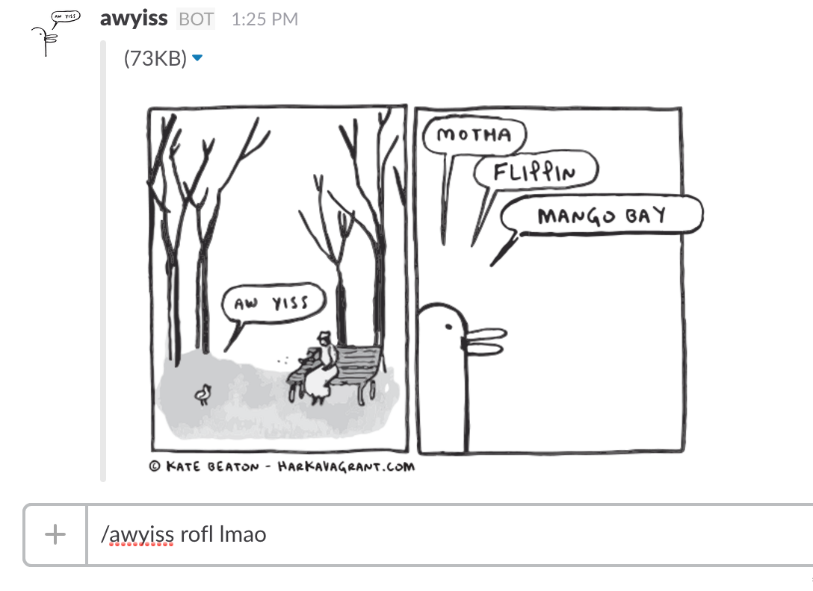

# Slack bot awyisser



A simple way to run your own Slack bot for generating awyiss images via the awesome [awyisser](http://www.awyisser.com/).

## Installation

1. Download and deploy this Sinatra app to [Heroku](https://devcenter.heroku.com/articles/rack#sinatra) or whatever service you prefer.

2. [Create a new slash command user](https://my.slack.com/services/new/slash-commands) integration for your Slack group. Configure your slash command with the following settings:
  - Set the Command to "/awyiss"

  - Set the URL as the one you deployed your app to + `/awyiss`. For Heroku, it will look something like `https://floating-thunder-7193.herokuapp.com/awyiss`

  - Set the Method to "GET".

3. Export your slash command's Token as `SLACK_COMMAND_TOKEN` to [Heroku](https://devcenter.heroku.com/articles/config-vars#setting-up-config-vars-for-a-deployed-application) / other environment.

## How to awyiss

```
/awyiss something awsome happened.
/awyiss very awsome happed.
```

## Playing it safe (sfw aw yissing)

```
/awyiss sfw hoi!! im temmie!!
/awyiss sfw lalalala!!!
```

## Extra configuration

The awyisser uses Movable Ink's image generator by default. You can choose to use awyisser.com to generate your awyiss image instead by setting `USE_AWYISSER_DOT_COM = true` in `awyisser.rb` before deploying. 

***WARNING!!!*** awyisser may tweet your yisses to [@awyisser](https://twitter.com/awyisser) if you configure the image generator URL to awyisser.com, sooo maybe don't say anything mean or confidential. You shouldn't do that anyway!

## Credits

Thanks to the wonderful [Kate Beaton](http://harkavagrant.com/) for writing the comic and [@quinnkeast](https://twitter.com/quinnkeast) for making the original awyisser. The bot is inspired by [hubot-awyisser](https://github.com/emilong/hubot-awyisser). Contributors to this project includes: [Ken Sin](https://github.com/ksin) and [Movable Ink](https://github.com/movableink).
