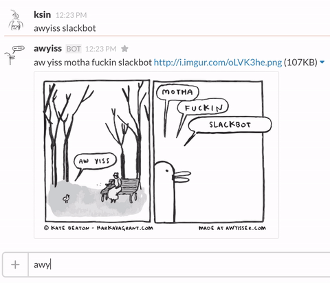

# Slack bot awyisser



A simple way to run your own Slack bot for generating awyiss images via the awesome [awyisser](http://www.awyisser.com/).

## Installation

Create a new bot user integration for your Slack group via [https://my.slack.com/services/new/bot](https://my.slack.com/services/new/bot)

Store the Slack api token for your bot:
```
export SLACK_API_TOKEN=<Your bot's token>
```

Start the bot:
```
ruby awyiss.rb
```

## How to awyiss

```
awyiss something awsome happened.
awyiss motha fuckin very awsome happed.
```

## Playing it safe (sfw aw yissing)

```
awyiss sfw hoi!!
awyiss sfw hoi! im temmie!!!
```

***WARNING!!!*** awyisser tweets all your yisses to [@awyisser](https://twitter.com/awyisser), so maybe don't put anything you don't want tweeted?

## Credits

Thanks to the wonderful [Kate Beaton](http://harkavagrant.com/) for writing the comic and [@quinnkeast](https://twitter.com/quinnkeast) for making the original awyisser. The bot is inspired by [hubot-awyisser](https://github.com/emilong/hubot-awyisser). Contributors to this project includes: [Ken Sin](https://github.com/ksin) and [Movable Ink](https://github.com/movableink).
